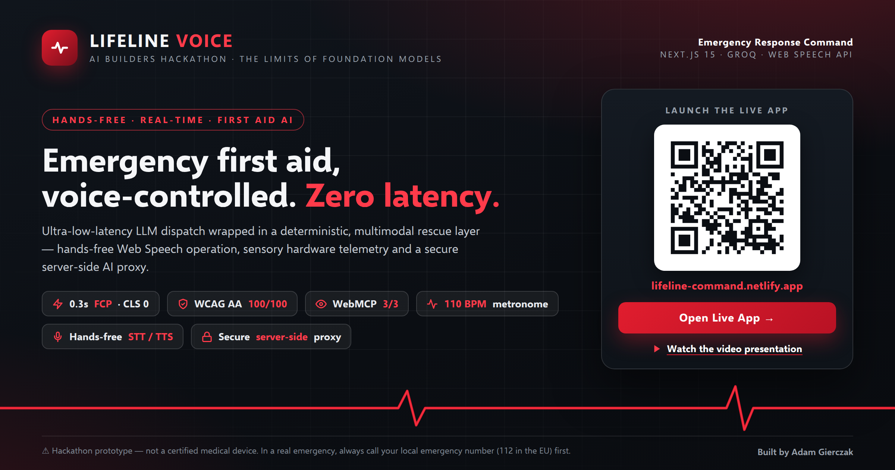

# ⚡ LifeLine Voice — Emergency Response Command

<p align="center">
  <a href="https://lifeline-command.netlify.app">
    
  </a>
</p>

> **Hands-Free, Real-Time Emergency First Aid Dispatcher** — powered by ultra-low-latency LLMs, Web Speech architecture, and sensory hardware telemetry.

Built for the **AI Builders Hackathon: Solving the Paradox of Intelligence Systems — The Limits of Foundation Models**.

> ⚠️ **Safety notice:** LifeLine Voice is a hackathon prototype and does **not** replace emergency dispatchers, certified first-aid guidance, or professional medical care. In a real emergency, always call your local emergency number (112 in the EU) first.


---

## 🎬 Video Demo & Live App

- 📺 **Watch the Video Presentation:** [LifeLine Voice — Video Presentation](https://www.youtube.com/watch?v=e7ny73qZxac)
- 🌐 **Launch the Live Emergency Command:** [lifeline-command.netlify.app](https://lifeline-command.netlify.app)

---

## 📑 Table of Contents

- [The Core Paradox](#the-core-paradox-the-limits-of-foundation-models)
- [The Solution](#the-solution-system-architecture-over-raw-intelligence)
- [Safety Architecture](#safety-architecture)
- [Adaptive Mobile-First Architecture](#adaptive-mobile-first-architecture)
- [Key Features](#key-features)
- [Tech Stack](#tech-stack)
- [Getting Started](#getting-started)
- [Hackathon Evaluation Summary](#hackathon-evaluation-summary)
- [Credits](#-credits)
- [License](#license)

---

## 🎯 The Core Paradox: The Limits of Foundation Models

State-of-the-art Foundation Models (LLMs) possess vast medical intelligence, yet in life-or-death physical emergencies, **raw Foundation Models completely fail**:

1. **The Latency Trap (Seconds Kill)** — In Sudden Cardiac Arrest (SCA), irreversible brain damage begins within 3–4 minutes. Standard LLM pipelines that deliberate, generate chain-of-thought (`thinking`) tokens, or take 4–8 seconds to respond are dangerously slow.
2. **The "Disembodied Mind" Problem** — A raw text model can state _"compress the chest at 100–120 beats per minute"_, but in a panic, humans cannot maintain accurate auditory-motor rhythm without sensory hardware telemetry.
3. **The Mobile & Physical Barrier** — Rescuers have their hands covered in fluids or occupied performing CPR. Chatboxes, typing on touchscreens, and phones dimming or locking during rescue make standard AI models unusable.
4. **Chattiness & "Obvious" Advice** — Raw models tend to be conversational or offer trivial background when immediate, imperative commands and non-obvious expert steps (e.g., removing jewelry before swelling) dictate survival.

## 💡 The Solution: System Architecture Over Raw Intelligence

**LifeLine Voice** resolves the Foundation Model Paradox by wrapping ultra-fast inference into a **deterministic, multimodal emergency operating layer**:

```text
┌─────────────────────────────────────────────────────────────┐
│                    PHYSICAL RESCUE SCENE                    │
│         High Adrenaline · Contaminated Hands · Noise        │
└──────────────────────────────┬──────────────────────────────┘
                               │ Voice Command (STT)
                               ▼
┌─────────────────────────────────────────────────────────────┐
│              HYBRID DUAL-ENGINE DISPATCH LAYER              │
├──────────────────────────────┼──────────────────────────────┤
│  CRITICAL PROTOCOLS          │  COMPLEX MEDICAL Q&A         │
│  • Sudden Cardiac Arrest     │  • "Nosebleed bleeding"      │
│  • Severe Choking            │  • "Chemical burns"          │
│  • Arterial Bleeding         │  • "Diabetic shock"          │
├──────────────────────────────┼──────────────────────────────┤
│  Local Deterministic         │  Secure Server-Side Proxy    │
│  Rescue Protocol (no network)│  Next.js Route Handler proxy │
│                              │  Prompt Guardrails · 3 snt.  │
│                              │  jewelry · ice · no vomiting │
└──────────────┴──────────────────────────────┴───────────────┘
               │                              │
               ▼                              ▼
┌─────────────────────────────────────────────────────────────┐
│                  MULTIMODAL SENSORY OUTPUT                  │
│   • Sensory Metronome — 110 BPM optical heartbeat pulse     │
│   • Hands-Free Text-to-Speech — instant audio dispatch      │
│    • Auto-Resuming Screen Wake Lock (visibilitychange)      │
│  • Device-Aware Mobile Speech Lifecycle (iOS / Android)     │
│    • Swiss-Brutalist High-Contrast Adaptive Typography      │
│            • One-Tap Emergency 112 Dial Bridge              │
└─────────────────────────────────────────────────────────────┘
```

## 🛡️ Safety Architecture

LifeLine Voice is designed as a **safety-first system**: the generative model is only one component, and every failure path has a designed response.

- **Emergency escalation first** — a persistent one-tap bridge to the 112 emergency number is always available, and every protocol and AI answer reinforces calling emergency services.
- **Deterministic routing for critical scenarios** — life-threatening protocols (CPR, choking, severe bleeding, unconsciousness) never depend on LLM generation; they are locally hardcoded and activate with no network round-trip.
- **Context locking** — the 110 BPM metronome is locked to the CPR context only and pauses automatically in other scenarios to prevent dangerous chest compressions on conscious patients.
- **Bounded AI responses** — the AI layer is constrained by explicit system-prompt guardrails: answers in at most 3 sentences, immediate action first, no diagnosing, no inventing procedures, no background chatter.
- **Graceful failure fallback** — API errors (Model-Not-Found 404, overload 429) and missing connectivity are handled by falling back to the local deterministic protocols — the system never blocks a rescuer mid-rescue.
- **Prototype disclaimer** — the app is a hackathon prototype, not a certified medical device (see the safety notice above and the disclaimer below).

## 📱 Adaptive Mobile-First Architecture

Mobile operating systems enforce strict sandbox and power-saving policies that break standard browser AI workflows. LifeLine Voice incorporates dedicated mobile-hardened countermeasures:

| Challenge on Mobile       | System Failure Without Architecture                                                         | LifeLine Voice Solution                                                                                                             |
| ------------------------- | ------------------------------------------------------------------------------------------- | ----------------------------------------------------------------------------------------------------------------------------------- |
| Continuous Listening      | Mobile OS forcibly kills the microphone after 3–5 s of silence (no-speech / aborted crash). | Discrete adaptive windows: desktop runs continuous listening; mobile switches to single-utterance windows with silent error reset.  |
| iOS Audio Autoplay Policy | Safari blocks `speechSynthesis` when triggered asynchronously by an AI API response.        | User-gesture audio unlock: the first tap triggers a silent synthetic utterance, priming the iOS audio engine for hands-free speech. |
| Mobile Screen Timeout     | Phones dim and sleep after ~30 s of inactivity, locking the rescuer out during CPR.         | Auto-resuming Screen Wake Lock: a `visibilitychange` listener re-acquires the screen lock whenever the app regains focus.           |
| 300 ms Tap Latency        | Mobile browsers delay touch events to detect double taps.                                   | `touch-action: manipulation` enforced globally on all emergency controls for immediate, tap-delay-free touch response.              |
| Speaker Echo & Monologue Lock | Device speaker loops into the microphone triggering infinite speech feedback; rescuer cannot interrupt long medical text. | Real-Time Voice Barge-In & Intent Gating: incoming audio is matched against rescue intents in real-time (`interimResults: true`). Any new imperative command immediately cancels ongoing speech (`speechSynthesis.cancel()`), while self-echo is silently suppressed. |

## 🚀 Key Features

### 🎙️ Zero-Latency Voice Barge-In & Hands-Free Operational Loop

Native browser Speech Recognition and Speech Synthesis (bilingual: `pl-PL` & `en-US`).

- **Real-Time Voice Barge-In (Instant Interruption):** In dynamic emergencies, patient status can deteriorate instantly (e.g., a choking victim collapses into cardiac arrest). The rescuer does not have to wait for the assistant to finish speaking: shouting a new command (e.g., *"Patient lost consciousness!"* or *"Start CPR!"*) immediately aborts the active speech synthesizer (`window.speechSynthesis.cancel()`) in under 200 ms and transitions to the new protocol with zero delay.
- **Acoustic Feedback & Echo Suppression:** Prevents the device speaker from triggering false positive commands in its own microphone. The engine analyzes incoming audio against deterministic emergency intents; ambient speaker audio is filtered out, while legitimate rescuer commands cut through effortlessly.
- **Single-Shot Interim Execution:** Uses real-time interim streaming (`interimResults: true`) for instant responsiveness, protected by session-index debouncing so instructions are spoken exactly once without repetitive stuttering.

### ⚡ 12 Deterministic ERC/AHA Emergency Protocols (0 ms Local Latency)

Core life-threatening physical emergencies never wait for cloud network round-trips. LifeLine Voice incorporates an expanded, locally validated catalog of pre-hospital protocols aligned with ERC/AHA resuscitation guidelines, specifically targeting dangerous human reflexes and common panic myths:

1. **Cardiopulmonary Resuscitation (CPR):** 30:2 compression-to-ventilation ratio, 5–6 cm depth, auto-starting the 110 BPM sensory metronome.
2. **Severe Choking & Airway Obstruction:** 5 back blows followed by 5 Heimlich abdominal thrusts with forward lean.
3. **Massive Arterial Bleeding:** Continuous direct pressure, limb elevation, strictly adding fresh layers without removing soaked dressings.
4. **Unconsciousness / Coma:** 10-second triple-sensory breathing assessment (look, listen, feel) and recovery position.
5. **Pediatric Fall & Head Trauma:** Strict cervical spine stabilization, checking for critical red flags (loss of consciousness, vomiting, abnormal drowsiness, absence of crying).
6. **Chemical / Detergent Ingestion (Laundry Pods):** **Strict prohibition of inducing vomiting** (preventing chemical foaming, esophageal re-burning, and lung flooding), oral water rinse, and upright positioning.
7. **Insect Sting in Mouth / Throat:** Imminent airway obstruction warning (<60s), immediate 112 dispatch, sucking ice cubes/cold water to retard internal edema, CPR readiness.
8. **Insect Sting on Skin:** Mechanical stinger scraping with a card/fingernail (never squeezing with tweezers to avoid venom injection), cold compress.
9. **Severe Thermal Burns:** 15–20 min cooling under clean running tap water, **immediate removal of rings, watches, and tight clothing before massive tissue edema**, loose sterile covering, never popping blisters.
10. **Epileptic Seizures & Convulsions:** Protecting head with soft clothing, **strictly forbidding inserting anything into the mouth**, no physical restraint during convulsions.
11. **Fractures & Dislocations:** Immobilization in the exact found position (including both adjacent joints), cold compress through fabric, no bone manipulation.
12. **Severe Nosebleeds:** Leaning forward (never tilting back to prevent gastrointestinal and pulmonary aspiration), continuous 10-minute nasal wing compression.

### 🔊 Phonetic Speech Normalization (TTS)

Maintains optimal visual legibility on screen while ensuring natural auditory delivery:
- **Visual Display:** High-contrast, minimal digits (`112`, `1.`, `2.`, `110 BPM`, `15-20 min`).
- **Acoustic Speech:** Synthesizer phonetically expands numbers and emergency codes to avoid robotic artifacts (PL: *"sto dwanaście"*, *"Po pierwsze"*, *"er-ka-o"* / EN: *"nine one one or one one two"*, *"Step one"*, *"C-P-R"*).

### 🔒 Secure Server-Side AI Proxy (Groq Llama 3.1)

Complex, open-ended questions outside the 12 deterministic protocols are securely proxied through a server-side Next.js Route Handler. The Groq API key is completely hidden from the browser. The AI response is strictly constrained to 3 actionable, imperative sentences without pleasantries or disclaimers.

### 💓 110 BPM Sensory Metronome with Safety Context Lock

Flashes the screen perimeter with a high-visibility optical pulse matching ERC/AHA compression guidelines (110 BPM) and emits distinct acoustic AED beeps alongside physical haptic vibration (`navigator.vibrate(45)`). Locked strictly to CPR context to prevent dangerous compressions on conscious patients.

### 🛡️ Screen Wake Lock Hardware Telemetry

Native Screen Wake Lock API integration with auto-recovery on `visibilitychange` ensures the smartphone screen never sleeps during active chest compressions.

## 🛠️ Tech Stack

| Layer              | Technology                                                                                          |
| ------------------ | --------------------------------------------------------------------------------------------------- |
| Framework          | Next.js 15 (App Router, React Hooks, Turbopack)                                                     |
| Architecture       | Secure Server-Side Route Handler Proxy (API keys never reach the browser)                           |
| AI Inference       | Groq Cloud API (`llama-3.1-8b-instant`) — accessed only via the Secure Route Handler                |
| Prompting          | Constrained emergency system prompt: non-obvious steps (jewelry, ice, no vomiting), max 3 sentences |
| Speech Processing  | Web Speech API (`SpeechRecognition` & `speechSynthesis`)                                            |
| Hardware Telemetry | Screen Wake Lock API, `visibilitychange` auto-recovery                                              |
| Styling & UI       | Tailwind CSS, Lucide React, high-contrast emergency design system                                   |
| Device Handling    | Adaptive desktop / mobile audio focus detection                                                     |

## ⚡ Performance, Accessibility & Quality Standards

LifeLine Voice is engineered for high-stress, life-critical scenarios where every millisecond and visual clarity matter:

### ♿ Accessibility (100/100 WCAG AA)

Rigorously tested high-contrast color palette (minimum 5.75:1 contrast ratio), screen-reader semantics, and unobstructed zoom.

### ⚡ Instant Emergency Readiness (0.3s FCP)

Zero layout shifts (CLS: 0) and sub-second paint times on both desktop and mobile devices.

### 🤖 Agentic Browsing Certified (3/3 WebMCP)

Fully compliant `llms.txt` standard index and declarative tool schema validated for autonomous AI agents.

### 🛡️ Best Practices & Security (100/100)

Clean console output, zero SSR hydration mismatches, and strict Content Security standards.

## 📦 Getting Started

### Prerequisites

- Node.js 18+
- pnpm or npm
- Free Groq API key ([console.groq.com](https://console.groq.com/))

### Installation

Clone the repository:

```bash
git clone https://github.com/AdamBabinicz/lifeline-voice.git
cd lifeline-voice
```

Install dependencies:

```bash
pnpm install
```

Set up environment variables — create a `.env.local` file in the project root (read **server-side only**, never shipped to the browser):

```env
GROQ_API_KEY=gsk_your_groq_api_key_here
```

Run the development server:

```bash
pnpm dev
```

Open [http://localhost:3000](http://localhost:3000) in your browser.

## 🏆 Hackathon Evaluation Summary

| Judging Criteria               | How LifeLine Voice Solves It                                                                                                                                                               |
| ------------------------------ | ------------------------------------------------------------------------------------------------------------------------------------------------------------------------------------------ |
| Solving the Paradox (20%)      | Solves the latency, chattiness, and hallucination paradox by implementing instant Voice Barge-In, acoustic feedback suppression, phonetic TTS normalization, and a 12-protocol deterministic emergency catalog (0 ms local latency) for life-critical physical scenarios. |
| Technical Implementation (20%) | Clean hybrid architecture: Web Speech STT/TTS + secure server-side Groq proxy (Route Handler) + auto-resuming Mobile Wake Lock + context-locked metronome.                                 |
| Innovation & Creativity (20%)  | Moves away from generic chatbots toward hands-free sensory dispatch — plus a constrained emergency prompt that teaches non-obvious survival steps.                                         |
| Design & UX (20%)              | High-contrast Swiss-Brutalist emergency typography designed for legibility during adrenaline-fueled panic.                                                                                 |
| Completeness & Polish (20%)    | Mobile-hardened (iOS/Android audio unlocking, error recovery), bilingual (PL/EN), graceful error fallbacks, API keys secured server-side.                                                  |

## 👤 Credits

LifeLine Voice was developed by **Adam Gierczak** as a solo project, leveraging a specialized AI-assisted workflow including v0.dev (UI scaffolding), GenSpark (research), ChatGPT and Claude (logic & architecture).

## 📜 License

Distributed under the [MIT License](LICENSE).

---

> ⚠️ **Disclaimer:** LifeLine Voice is a hackathon prototype built for educational purposes — it is **not** a certified medical device. In a real emergency, always call your local emergency number (112 in the EU) first.
